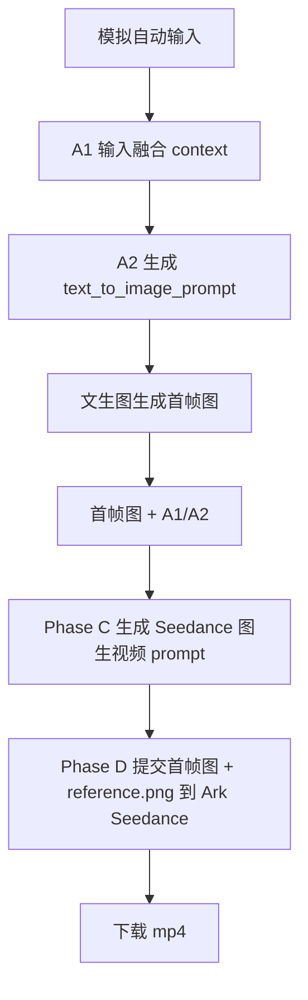

# TUTU Prompt Pipeline

这套流程现在主线分成四层：

1. `A1 context`：把自动输入融合成统一创意上下文
2. `A2 text_to_image_prompt`：直接生成文生图 prompt，用来生成首帧图
3. `Phase B Replicate text-to-image`：用文生图 prompt 生成首帧图
4. `Phase C/Phase D Seedance`：先生成图生视频 prompt，再调用 Ark Seedance 生视频并下载

也就是说，当前中间不再额外拆短 prompt 或首帧 prompt，A2 会直接产出文生图 prompt。等首帧图出来后，Phase C 贴着真实图片写 Seedance 图生视频 prompt，Phase D 负责提交 Ark 任务、轮询状态和下载视频。

## 总链路



当前代码已跑通：

`A1 context -> A2 text_to_image_prompt -> Phase B 文生图首帧 -> Phase C 图生视频 prompt -> Phase D Seedance 视频下载`

已完成的测试批次：

- 50 条 A1/A2 prompt：[gemini_25_flash_50_b25](/f:/workspace/tutu内容/agent/outputs/gemini_25_flash_50_b25)
- 50 张首帧图：[replicate_qwen_image_distilled_test_1109_50/images](/f:/workspace/tutu内容/agent/outputs/replicate_qwen_image_distilled_test_1109_50/images)
- 50 条 Seedance prompt：[phase_c_seedance_i2v_prompts.md](/f:/workspace/tutu内容/agent/outputs/seedance_i2v_prompts_gemini_31_pro_preview_50/phase_c_seedance_i2v_prompts.md)
- 前 10 条 Seedance 视频：[seedance_videos_first_10/videos](/f:/workspace/tutu内容/agent/outputs/seedance_videos_first_10/videos)

核心脚本：

- `phase_a.py`：A1/A2 生成
- `phase_b_replicate_images.py`：Replicate 文生图
- `phase_c_seedance_i2v_prompts.py`：Gemini 生成 Seedance I2V prompt
- `phase_d_seedance_videos.py`：Ark Seedance 任务提交、轮询和下载

如果想直接看完整样例，可以看：[20个完整流程示例.md](/f:/workspace/tutu内容/agent/20个完整流程示例.md)

## 为什么现在这样做

`context -> text_to_image_prompt`

这样更适合当前阶段，因为我们现在最需要的是先批量生成首帧图 prompt，而不是在中间多绕几层。

## 当前输出文件

默认运行后输出：

- `phase_a_contexts.jsonl`
- `phase_a_text_to_image_prompts.jsonl`
- `manifest.json`

完整链路实际会用到这些输出：

- A1 context：`agent/outputs/gemini_25_flash_50_b25/phase_a_contexts.jsonl`
- A2 文生图 prompt：`agent/outputs/gemini_25_flash_50_b25/phase_a_text_to_image_prompts.jsonl`
- 首帧图：`agent/outputs/replicate_qwen_image_distilled_test_1109_50/images/*.png`
- Replicate 任务记录：`agent/outputs/replicate_qwen_image_distilled_test_1109_50/replicate_predictions.jsonl`
- Phase C 图生视频 prompt：`agent/outputs/seedance_i2v_prompts_gemini_31_pro_preview_50/phase_c_seedance_i2v_prompts.jsonl`
- Phase C 可读版：`agent/outputs/seedance_i2v_prompts_gemini_31_pro_preview_50/phase_c_seedance_i2v_prompts.md`
- Phase D Seedance 任务记录：`agent/outputs/seedance_videos_first_10/seedance_tasks.jsonl`
- 下载视频：`agent/outputs/seedance_videos_first_10/videos/*.mp4`

`phase_a_text_to_image_prompts.jsonl` 里每条会包含：

```json
{
  "event_id": "evt_ctx_xxx_night",
  "context_id": "ctx_xxx",
  "slot": "night",
  "slot_time_hint": "21:00",
  "title": "枕边垫纸",
  "summary": "蘑菇TUTU把一小角纸巾垫到柔软枕头边缘，形成一个安静的生活画面。",
  "triggered_by": "action",
  "text_to_image_prompt": "蘑菇TUTU在柔软蓬松的枕头边缘，用两只小手把一小角纸巾垫到枕面凹陷处，安静明亮的室内生活氛围，画面干净通透，柔和的光束，奶油般柔和的散景"
}
```

## A1：Context

A1 负责把自动输入融合成 `context`。

输入来自这些参考模块：

- `daily`：时间氛围
- `weather`：天气条件
- `background`：背景环境
- `lifestyle`：生活质感
- `action`：秃秃做什么
- `mood`：秃秃的情绪
- `guardrail`：安全、合理性、去模板化

注意：

- 这些模块只是参考，不是例子库
- 不要从池子里抽句子拼接
- `slot` 只是时间氛围，不限制行为
- 晚上可以出去玩，早上也不必刚醒
- 不要新增 user、memory、chat 字段

A1 不需要按一堆字段去理解，按池子理解就行：

- `daily/weather`：提供时间和天气参考
- `background/lifestyle/action/mood`：生成蘑菇TUTU这条文生图 prompt 的创意内容
- `background` 只保留一个字段，不再拆成 `background_env` / `background_topic` / `background_reason`
- `season` 只保留季节和节气，不带地区或城市字段
- `action` 现在必须是“正在做一件小事”，并且要和日常物体发生互动，比如推动纸片、拨开水痕、搬动面包屑、用叶片遮光、搭小桥、整理线头
- 不要把 action 写成“站在/停在某处观察/看/被吸引/好奇地靠近”

当前程序输出仍然是扁平 JSON，只是为了方便 A2 读取。

## A2：Text-To-Image Prompt

A2 负责直接生成文生图 prompt。

这一层合入了蘑菇TUTU文生图规范：

- 主角必须是 `蘑菇TUTU`
- 它是微缩生物，约 4cm 高，但文生图 prompt 里不要直接写 `4cm` 或 `4cm 高的微缩有生命蘑菇`
- 不要在文生图 prompt 里写任何说明它很小的语句
- 它必须正在做一件具体小事，并且和日常物体发生互动
- 它不总是穿衣服
- 它不总是做夸张表情
- 可以有自然状态、恬静、无表情类别

禁止：

- 不要写“4cm”
- 不要写“4cm 高的微缩有生命蘑菇”
- 不要写“微缩有生命蘑菇”
- 不要只写“站在某处观察/看着某物/被某物吸引/好奇地靠近”
- 不要写“橙色伞盖”
- 不要写“白点”
- 不要写“米色身体”
- 不要写“发光粒子”
- 不要写“照亮的尘埃”
- 不要写“漂浮的灰尘”
- 不要写“圆形光斑”

推荐替代表达：

- “柔和的光束”
- “通透的光影”
- “空气感”
- “明亮均匀的光线”
- “奶油般柔和的散景”
- “朦胧的色块”

## Phase B：Replicate 文生图/图像编辑

当前新增脚本：

```powershell
& 'F:\workspace\tutu内容\_tools\python311\python.exe' 'F:\workspace\tutu内容\agent\phase_b_replicate_images.py' `
  --input-jsonl 'F:\workspace\tutu内容\agent\outputs\gemini_25_flash_50_b25\phase_a_text_to_image_prompts.jsonl' `
  --output-dir 'F:\workspace\tutu内容\agent\outputs\replicate_images' `
  --deployment 'picaa/qwen-image-distilled-test-1109' `
  --limit 1 `
  --seed 1000 `
  --download
```

当前可用的文生图 deployment 是 `picaa/qwen-image-distilled-test-1109`。之前测试过 `picaa/qwen-image-edit-with-sam3`，它运行时会报 `未提供输入图片，无法生成内容`，所以不适合直接从 prompt 文生图。

运行前设置：

```powershell
$env:REPLICATE_API_TOKEN='你的 Replicate token'
```

## Phase C：Seedance 图生视频 Prompt

当前新增提示词设计：

[phase_c_seedance_i2v_system_prompt.md](/f:/workspace/tutu内容/agent/phase_c_seedance_i2v_system_prompt.md)

这一层输入：

`首帧图 + A2 text_to_image_prompt -> Seedance 图生视频 prompt`

实际使用时建议一起传：

- 首帧图
- 同一个 `context_id` 的 A1 context
- 同一个 `context_id` 的 A2 `title / summary / triggered_by / text_to_image_prompt`

Phase C 的规则是：首帧图片优先，A1/A2 只作为事件意图参考；只写首帧真实可见的物体和空间关系；动作从蘑菇TUTU当前状态自然延续成一段约 15 秒的连续小事件；环境、构图、光照和背景物体保持稳定，但蘑菇TUTU的动作要清楚、有幅度、可见，并自然包含表情或眼神变化；镜头稳定观察，不要拉近镜头，不要把重点写成“极轻微运镜”；不要频繁使用“极轻微”“微幅”“小范围”“几毫米”“几乎不动”“安静收住”“轻轻停住”等削弱动作幅度的表达；不要写 JSON 或解释。

这一层默认用 `gemini-3.1-pro-preview`，因为它需要读首帧图并对齐 A1/A2 结构。

Phase C 只输入一张图：

- 当前条目的首帧图

但 Phase C 输出 prompt 会以这句开头，因为 Phase D 提交 Seedance 时会额外把 `F:\workspace\tutu内容\agent\reference.png` 作为第二张参考图传给 Ark：

```text
以输入图片为第一帧，第二张图片为参考图，保持整体构图、透视关系与空间结构一致
```

Seedance API 执行层才应该出现：

- `payload`
- `task_id`
- `video_url`
- `status`
- `download_path`

这些字段不要混进 A1/A2。

## Phase D：Seedance 生视频任务

当前新增脚本：

```powershell
& 'F:\workspace\tutu内容\_tools\python311\python.exe' 'F:\workspace\tutu内容\agent\phase_d_seedance_videos.py' `
  --limit 1 `
  --output-dir 'F:\workspace\tutu内容\agent\outputs\seedance_videos_temp_check'
```

默认只是检查 payload，会在临时目录的 `payloads` 里生成 Ark 请求体，不会真的提交任务；展示目录里只保留已经跑通的 `seedance_videos_first_10`。

实际提交时：

```powershell
$env:ARK_API_KEY='你的 Ark API key'
& 'F:\workspace\tutu内容\_tools\python311\python.exe' 'F:\workspace\tutu内容\agent\phase_d_seedance_videos.py' `
  --limit 1 `
  --execute `
  --wait `
  --download
```

注意：Ark 示例里 `image_url` 使用公网 URL。首帧图会优先用 Replicate 返回的公网 URL；`reference.png` 是本地文件，脚本会默认转成 data URL 试用。如果 Ark 不支持 data URL，需要先把 `reference.png` 上传到可访问的公网地址，然后用 `--reference-image-url 'https://...'`。

前 10 条实测命令：

```powershell
$env:ARK_API_KEY='你的 Ark API key'
& 'F:\workspace\tutu内容\_tools\python311\python.exe' 'F:\workspace\tutu内容\agent\phase_d_seedance_videos.py' `
  --limit 10 `
  --output-dir 'F:\workspace\tutu内容\agent\outputs\seedance_videos_first_10' `
  --execute `
  --wait `
  --download `
  --force `
  --timeout 180
```

本次前 10 条已经全部生成并下载到：

[seedance_videos_first_10/videos](/f:/workspace/tutu内容/agent/outputs/seedance_videos_first_10/videos)

## 运行方式

```powershell
& 'F:\workspace\tutu内容\_tools\python311\python.exe' 'F:\workspace\tutu内容\agent\phase_a.py' --run-label spring_batch --count 50 --batch-size 25
```

如果用官方 Gemini API，当前批量生成建议用 `gemini-2.5-flash`，速度和质量比较平衡：

```powershell
$env:GEMINI_API_KEY='你的 Gemini key'
$env:GEMINI_URL='https://generativelanguage.googleapis.com/v1beta/models/gemini-2.5-flash:generateContent'
```
