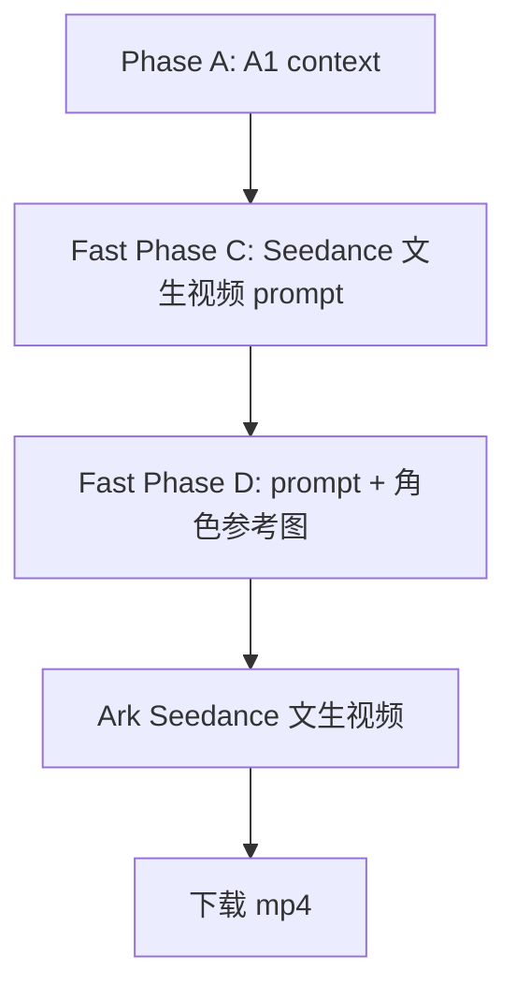

# TUTU Fast Seedance Pipeline

这个目录是“跳过文生图，直接文生视频”的实验版。

主线只有三层：

1. `Phase A`：生成 A1 context，包含时间、天气、背景、生活主题、动作主题、情绪主题。
2. `Fast Phase C`：只读取 A1 context，直接生成 Seedance 文生视频 prompt。
3. `Fast Phase D`：把文生视频 prompt 和一张角色参考图提交给 Ark Seedance，生成视频。

这一版**不生成文生图 prompt**，**不跑 Replicate 文生图**，也**不生成首帧图**。



## 和原版的区别

原版高可控链路：

```text
A1 context -> 文生图首帧 -> 图生视频 prompt -> Seedance 图生视频
```

fast 版链路：

```text
A1 context -> Seedance 文生视频 prompt -> Seedance 文生视频
```

fast 版的优点：

- 少一次文生图 prompt 生成。
- 少一次 Replicate 文生图。
- 不需要首帧图公网 URL。
- 链路更短，更适合验证文生视频能力。

fast 版的风险：

- 没有首帧图锁定构图，场景和道具更依赖文字 prompt。
- 角色外观由参考图辅助约束，但具体开场画面由 Seedance 自己生成。
- 场景稳定性可能不如原版 I2V 链路。

## 文件结构

核心脚本：

- `phase_a.py`：生成 A1 context。
- `phase_c_seedance_t2v_prompts.py`：只读取 A1 context，生成 Seedance 文生视频 prompt。
- `phase_d_seedance_t2v_videos.py`：提交 prompt + 角色参考图到 Ark Seedance。
- `phase_c_seedance_t2v_system_prompt.md`：fast 版文生视频 prompt 系统提示词。

已复制的 A 阶段样本：

- `outputs/gemini_25_flash_50_b25/phase_a_contexts.jsonl`

## 生成 A1 context

```powershell
& 'F:\workspace\tutu内容\_tools\python311\python.exe' 'F:\workspace\tutu内容\agent_fast\phase_a.py' --count 50 --output-dir 'F:\workspace\tutu内容\agent_fast\outputs\fast_contexts_50'
```

## 生成 fast 文生视频 prompt

```powershell
& 'F:\workspace\tutu内容\_tools\python311\python.exe' 'F:\workspace\tutu内容\agent_fast\phase_c_seedance_t2v_prompts.py' --limit 50
```

默认输出到：

```text
agent_fast/outputs/seedance_t2v_prompts_gemini_31_pro_preview_50/
```

其中：

- `phase_c_seedance_t2v_prompts.jsonl`：机器可读版。
- `phase_c_seedance_t2v_prompts.md`：人工查看版。

## 提交 Seedance 文生视频

先 dry-run 看 payload，不提交任务：

```powershell
& 'F:\workspace\tutu内容\_tools\python311\python.exe' 'F:\workspace\tutu内容\agent_fast\phase_d_seedance_t2v_videos.py' --limit 1
```

实际提交、等待并下载：

```powershell
$env:ARK_API_KEY='你的 Ark API key'
& 'F:\workspace\tutu内容\_tools\python311\python.exe' 'F:\workspace\tutu内容\agent_fast\phase_d_seedance_t2v_videos.py' `
  --limit 1 `
  --execute `
  --wait `
  --download `
  --force
```

默认参数：

- model: `doubao-seedance-2-0-260128`
- ratio: `9:16`
- duration: `15`
- generate_audio: `true`
- watermark: `false`
- reference image: `agent_fast/reference.png`

## Payload 结构

fast 版只给 Seedance 一段文本和一张角色参考图：

```json
{
  "model": "doubao-seedance-2-0-260128",
  "content": [
    {
      "type": "text",
      "text": "以参考图中的蘑菇TUTU作为唯一角色参考，保持角色外观特征一致，..."
    },
    {
      "type": "image_url",
      "image_url": {
        "url": "角色参考图的 URL 或 data URL"
      },
      "role": "reference_image"
    }
  ],
  "generate_audio": true,
  "ratio": "9:16",
  "duration": 15,
  "watermark": false
}
```

注意：Ark 官方示例里 `image_url` 通常使用公网 URL。当前脚本默认会把本地 `reference.png` 转成 data URL 试用；如果 Ark 不支持 data URL，需要先把参考图上传到公网，然后传：

```powershell
--reference-image-url 'https://.../reference.png'
```
