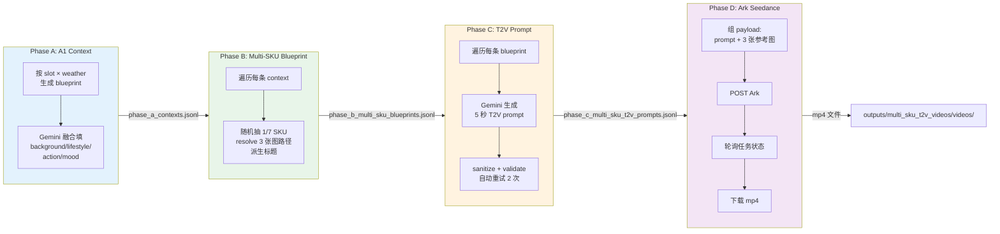
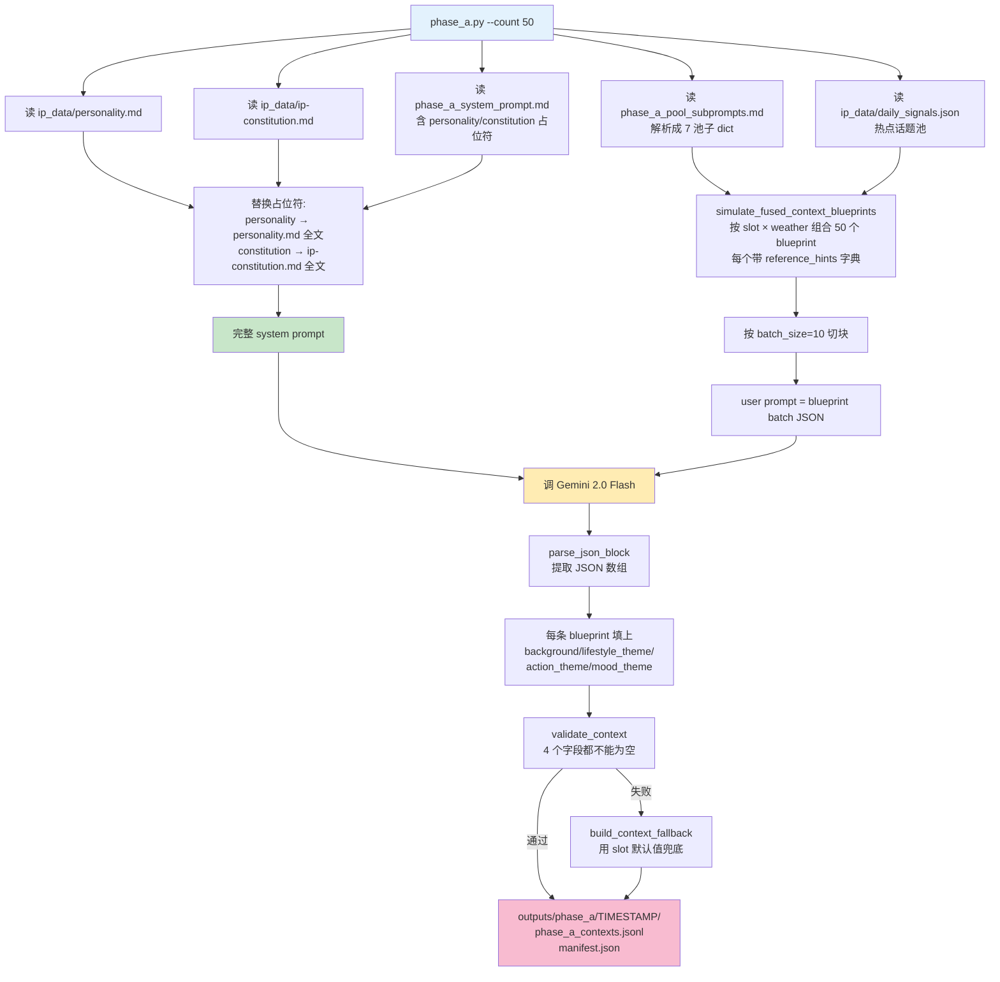
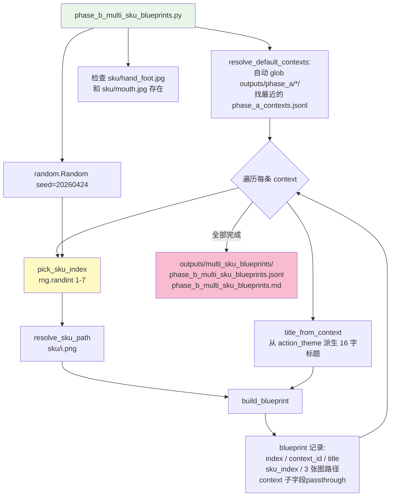
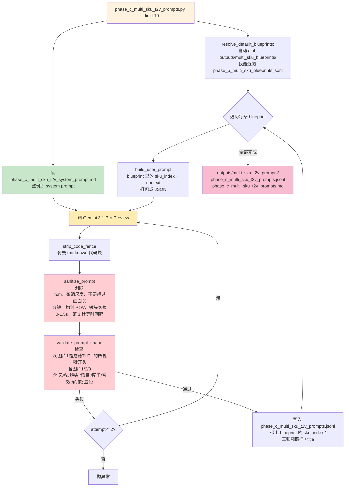
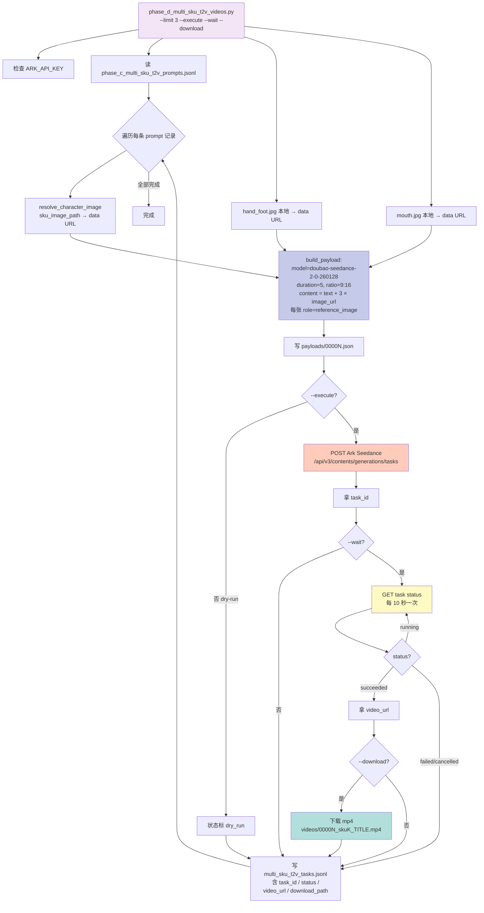
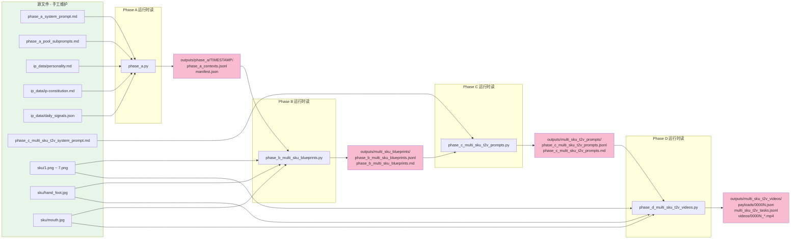
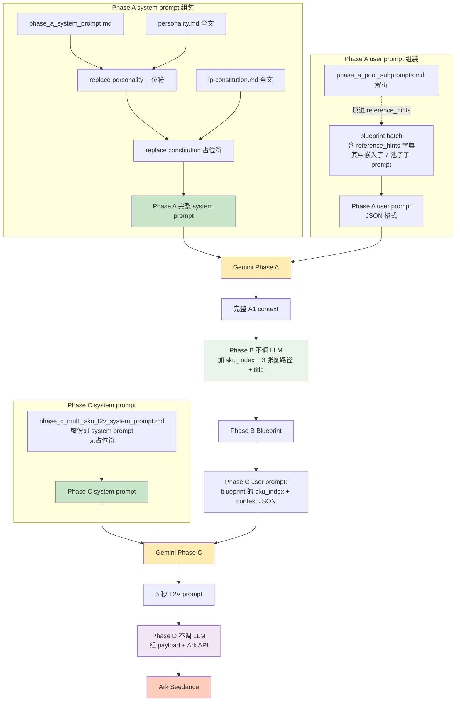

# TUTU Multi-SKU 5s Pipeline 完整流程图

> 本文档展示 `tutu多sku文生视频流/` 从 Phase A 到 Phase D 的完整数据流、文件 I/O 和 system prompt 注入过程。
>
> 所有流程图用 mermaid 语法写，支持 GitHub / VS Code / Obsidian 等主流 markdown 渲染器。每个图下面附一段文字说明。

---

## 1. 总览图：四个 Phase 的串联



**读图要点**：

- **Phase A** 只负责规划创意上下文，调 Gemini
- **Phase B** 做确定性准备工作：挑 SKU、查路径、写标题，**不调 LLM**
- **Phase C** 把 blueprint 改写成实际喂给 Seedance 的中文 prompt，调 Gemini
- **Phase D** 不调 LLM，只做 Ark API 调用和 mp4 下载
- 四阶段之间通过 jsonl 文件解耦，任一阶段都可以单独重跑

**拆成 A/B/C/D 的好处**：

- 换 system prompt → 只重跑 Phase C，SKU 分配保持稳定可比
- 换 SKU 随机种子 → 只重跑 Phase B，context 不动
- 添加新 SKU → 只重跑 Phase B，前后都不用动
- Ark API 提交失败 → 只重跑 Phase D

---

## 2. Phase A 详细流程（含 system prompt 注入）



**关键说明**：

1. **四份 md/json 文件一起组装 system prompt**：
   - `phase_a_system_prompt.md` 是模板（带两个 `{...}` 占位符）
   - 运行时替换 `{personality}` 和 `{constitution}` 成 IP 数据的完整内容
   - `phase_a_pool_subprompts.md` 不进 system prompt，而是作为 `reference_hints` 字典附在每条 blueprint 上
2. **blueprint 结构**：每条已有 `slot` / `weather` / `season`，**留空** `background` / `lifestyle_theme` / `action_theme` / `mood_theme` 四字段等 Gemini 来填
3. **batch 批处理**：50 条按 10 条一批调 Gemini
4. **Fallback 容错**：如果 Gemini 返回某条 context 缺字段，按 slot 默认值兜底

### Phase A 产出样本

```json
{
  "context_id": "ctx_multi_sku_batch_00001",
  "slot": "morning",
  "slot_time_hint": "08:30",
  "weather": "晴，有风，24度",
  "season": "晚春",
  "background": "晚春晨光下的生活角落，一张木质桌面靠窗边",
  "lifestyle_theme": "轻盈、刚开始展开的一天感",
  "action_theme": "蘑菇TUTU 扒住玻璃杯边缘想探看杯里水面的倒影",
  "mood_theme": "清爽里带一点好奇和主动性",
  "reference_hints": { "...7 个池子的子 prompt 摘要..." }
}
```

---

## 3. Phase B 详细流程（随机 SKU + 参考图路径 + 标题）



**关键说明**：

1. **完全不调 LLM**，只做确定性处理，通常几秒跑完
2. **SKU 随机时机**：在 Phase B 里随机（不再是 Phase C），写进 JSONL 的 `sku_index` 字段。`--seed` 控制复现
3. **三张参考图路径都在这一步定好**：`sku_image_path` / `hand_foot_image_path` / `mouth_image_path` 全部 resolve 成绝对路径并检查文件存在，避免 Phase D 提交时才发现路径错
4. **context 字段 passthrough**：把 A1 context 的 10 个字段嵌套在 blueprint 的 `context` 字段里，Phase C 拿到 blueprint 就有完整的上下文，不用再反查 A1 context 文件
5. **标题派生**：用 `action_theme` 前 16 个字符，剥去标点作为 `title`，用于后续视频文件名

### Phase B 产出样本

```json
{
  "index": 1,
  "context_id": "ctx_multi_sku_batch_00001",
  "title": "蘑菇TUTU扒住玻璃杯边缘想探",
  "sku_index": 3,
  "sku_image_path": ".../sku/3.png",
  "hand_foot_image_path": ".../sku/hand_foot.jpg",
  "mouth_image_path": ".../sku/mouth.jpg",
  "context": {
    "slot": "morning",
    "slot_time_hint": "08:30",
    "daily": "...",
    "weather": "晴，有风，24度",
    "season": "晚春",
    "solar_term": "清明后",
    "background": "晚春晨光下的生活角落，一张木质桌面靠窗边",
    "lifestyle_theme": "轻盈、刚开始展开的一天感",
    "action_theme": "蘑菇TUTU 扒住玻璃杯边缘想探看杯里水面的倒影",
    "mood_theme": "清爽里带一点好奇和主动性"
  }
}
```

---

## 4. Phase C 详细流程（blueprint → 5s T2V prompt）



**关键说明**：

1. **输入是 Phase B 的 blueprint**（不是 Phase A 的 A1 context）：blueprint 里已经有 `sku_index` 和 `context`，Phase C 不再负责随机或查路径
2. **blueprint 文件自动发现**：默认不用传 `--blueprints-jsonl`，脚本会 glob 找最新的 Phase B 产物
3. **只做一件事：调 Gemini**。system prompt + blueprint 打包的 user prompt → T2V prompt
4. **双层质量闸门**：
   - `sanitize_prompt` 硬过滤违规词（抽象尺度、切镜语言、时间码）
   - `validate_prompt_shape` 检查结构（首段开头、图片引用、五段标签）
   - 任一失败 → 自动重试最多 2 次
5. **三张参考图路径从 blueprint 透传**到 Phase C 的 JSONL，Phase D 直接用

### Phase C 产出样本

```json
{
  "index": 1,
  "context_id": "ctx_multi_sku_batch_00001",
  "title": "蘑菇TUTU扒住玻璃杯边缘想探",
  "sku_index": 3,
  "sku_image_path": ".../sku/3.png",
  "hand_foot_image_path": ".../sku/hand_foot.jpg",
  "mouth_image_path": ".../sku/mouth.jpg",
  "seedance_t2v_prompt": "图片1是蘑菇TUTU的四视图…\n\n风格：…\n\n镜头：…\n\n场景：首先…接着…最后…\n\n配乐/音效：…\n\n约束：…",
  "status": "succeeded"
}
```

---

## 5. Phase D 详细流程（组 payload + Ark 调用 + 下载）



**关键说明**：

1. **无 LLM 调用**：Phase D 全程不调 Gemini，只和 Ark Seedance API 交互
2. **三张图片一起传**：`build_payload` 把 SKU 四视图 + 手脚图 + 嘴巴图三张都作为 `reference_image` 放进 content 数组
3. **本地图片 → data URL**：默认把本地 jpg/png 转成 `data:image/...;base64,...` 直接放进 `image_url.url`。如果 Ark 项目不支持 data URL，用 `--hand-foot-image-url / --mouth-image-url` 传公网 URL 覆盖
4. **三级开关**：
   - 不加 `--execute` → 只生成 payload JSON，不真提交（dry-run）
   - 加 `--execute` 但不加 `--wait` → 只创建任务，不等结果
   - 加 `--execute --wait --download` → 创建、轮询到结束、下载 mp4
5. **幂等**：任务状态落 `multi_sku_t2v_tasks.jsonl`，再次运行默认跳过已有 index。加 `--force` 重新跑

### Phase D 产出样本

```json
{
  "index": 1,
  "sku_index": 3,
  "title": "蘑菇TUTU扒住玻璃杯边缘想探",
  "payload_path": ".../payloads/00001.json",
  "task_id": "cgt-2026-xxxxxx",
  "status": "succeeded",
  "video_url": "https://ark-content.volcapi.com/...",
  "download_path": ".../videos/00001_sku3_蘑菇TUTU扒住玻璃杯边缘想探.mp4",
  "ratio": "9:16",
  "duration": 5
}
```

---

## 6. 全局文件 I/O 地图



**读图要点**：

- **绿色块**：手工维护的源文件，修改这些会直接影响下一次运行
- **粉色块**：运行时自动生成的 outputs，四阶段串联靠这些 jsonl 文件传递
- **SKU + 参考图**：被 Phase B（写路径）和 Phase D（拼 data URL）都读。Phase C 不读图片本身，只从 blueprint 里取路径字符串

---

## 7. System Prompt 注入详细图



**关键说明**：

- **Phase A 的 system prompt** = `phase_a_system_prompt.md` + `{personality}` 替换 + `{constitution}` 替换
- **Phase A 的 user prompt** = blueprint JSON，其中 `reference_hints` 字典的 7 个键来自 `phase_a_pool_subprompts.md`
- **Phase B 没 system prompt**：只是 Python 代码做随机选择 + 路径解析
- **Phase C 的 system prompt** = `phase_c_multi_sku_t2v_system_prompt.md` 整份（不替换任何占位符）
- **Phase C 的 user prompt** = "请改写这条 blueprint" + blueprint 的 sku_index + context JSON
- **Phase D 没 system prompt**：只提交到 Ark

---

## 8. 数据字段跨 Phase 传递表

| 字段 | Phase A 产出 | Phase B 消费 | Phase B 产出 | Phase C 消费 | Phase C 产出 | Phase D 消费 | Phase D 产出 |
|------|-------------|-------------|-------------|-------------|-------------|-------------|-------------|
| `context_id` | ✓ | ✓ | ✓ | ✓ | ✓ | ✓ | ✓ |
| `slot / weather / season` | ✓ | → 存进 context | ✓（嵌在 context 子字段） | ✓（融入 prompt 风格段） | - | - | - |
| `background` | ✓ | → 存进 context | ✓ | ✓ | - | - | - |
| `action_theme` | ✓ | → 存进 context、派生 title | ✓ | ✓（扩展成 5s 动作链） | - | - | - |
| `mood_theme` | ✓ | → 存进 context | ✓ | ✓（融入表情描述） | - | - | - |
| `title` | - | 从 action_theme 派生 | ✓ | ✓ 透传 | ✓ | ✓（文件名） | ✓ |
| `sku_index` | - | 随机 1-7 | ✓ | ✓（进 prompt JSON） | ✓ 透传 | ✓ | ✓ |
| `sku_image_path` | - | resolve 绝对路径 | ✓ | ✓ 透传 | ✓ | ✓（→ data URL） | - |
| `hand_foot_image_path` | - | resolve | ✓ | ✓ 透传 | ✓ | ✓（→ data URL） | - |
| `mouth_image_path` | - | resolve | ✓ | ✓ 透传 | ✓ | ✓（→ data URL） | - |
| `seedance_t2v_prompt` | - | - | - | Gemini 生成 | ✓ | ✓ | ✓（复制进 task 记录） |
| `task_id` | - | - | - | - | - | Ark 返回 | ✓ |
| `video_url` | - | - | - | - | - | Ark 返回 | ✓ |
| `download_path` | - | - | - | - | - | 下载后填 | ✓ |

---

## 9. 常用运行命令速查

```powershell
# Python 解释器（Windows 工作区专用）
$PY = 'F:\workspace\tutu内容\_tools\python311\python.exe'
$DIR = 'F:\workspace\tutu内容\tutu多sku文生视频流'

# Phase A：生成 50 条 A1 context
& $PY "$DIR\phase_a.py" --count 50

# Phase B：随机 SKU + 参考图路径 + 标题（无 LLM，秒级完成）
& $PY "$DIR\phase_b_multi_sku_blueprints.py"

# Phase C：生成 5 条 T2V prompt（自动找最新 Phase B 产物）
& $PY "$DIR\phase_c_multi_sku_t2v_prompts.py" --limit 5

# Phase D dry-run：看 payload 结构
& $PY "$DIR\phase_d_multi_sku_t2v_videos.py" --limit 1

# Phase D 真跑 1 条：提交 + 等待 + 下载
$env:ARK_API_KEY='你的 Ark key'
& $PY "$DIR\phase_d_multi_sku_t2v_videos.py" --limit 1 --execute --wait --download
```

---

## 10. 速查：想改某个行为，应该改哪个文件

| 想改什么 | 改哪个文件 |
|---------|----------|
| TUTU 的人格底色（好奇心、胆小等） | `ip_data/personality.md` |
| TUTU 的外观铁律（毛绒、4cm、不能有牙齿等） | `ip_data/ip-constitution.md` |
| Phase A 如何把 blueprint 融合成 context | `phase_a_system_prompt.md` |
| Phase A 各时段 / 各天气 / 各池子的取向 | `phase_a_pool_subprompts.md` |
| Phase A 的 slot × weather 组合规则 | `phase_a.py` 里的 `TIME_SLOTS` / `SIMULATED_WEATHERS` |
| Phase B 的 SKU 数量（默认 7） | `phase_b_multi_sku_blueprints.py` 里的 `SKU_COUNT` |
| Phase B 的 SKU 随机种子 | 运行时 `--seed N` |
| Phase B 的标题派生逻辑（默认 16 字） | `phase_b_multi_sku_blueprints.py` 里的 `title_from_context` |
| Phase C 的 5 秒 T2V prompt 规则（段落结构、尺度控制、顺序词等） | `phase_c_multi_sku_t2v_system_prompt.md` |
| Phase C 的 sanitize 黑名单（时间码、切镜词等） | `phase_c_multi_sku_t2v_prompts.py` 里的 `FORBIDDEN_SUBSTR_REPLACEMENTS` / `TIME_CODE_PATTERNS` |
| Phase D 的模型 / 时长 / ratio | 运行时 `--model` / `--duration` / `--ratio`，默认在 `phase_d_multi_sku_t2v_videos.py` |
| 更换 SKU 素材 | `sku/1.png` ~ `sku/7.png` 覆盖 |
| 更换手脚 / 嘴巴参考图 | `sku/hand_foot.jpg` / `sku/mouth.jpg` 覆盖 |
